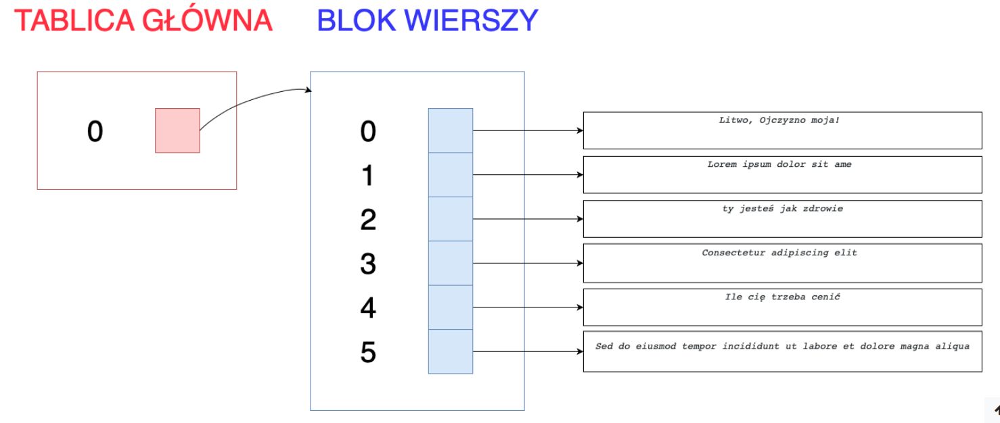

###### Rozwiązania są kompletne
----
—

Zarządzanie pamięcią, biblioteki, pomiar czasu 
-----------------------------------------------

### Zadanie 1. Alokacja tablicy ze wskaźnikami na bloki pamięci zawierające  tablicę wskaźników (25%)  

### **Zaprojektuj i przygotuj zestaw funkcji (bibliotekę) do zarządzania tablicą bloków, w których to blokach pamięci zapisywane są rezultaty operacji porównywania mergowania dwóch plików wiersz po wierszu (round robin: 1 wiersz pliku A, 1 wiersz pliku B itd.) sekwencji par plików  — sekwencja ich nazw jest parametrem funkcji.**  

  
**Biblioteka powinna umożliwiać:**  
  

*   Utworzenie tablicy wskaźników (tablicy głównej) — w tej tablicy będą przechowywane wskaźniki na wiersze zmergowanych plików — pierwszy element tablicy głównej zawiera wykaz wierszy pierwszej pary zmergowanych plików, drugi element dla drugiej pary, itd. Pojedynczy blok wierszy (element wskazywany z tablicy głównej), to tablica wskaźników na poszczególne wiersze w zmergowanym pliku  
    
*   Definiowanie sekwencji par plików  
    
*   Przeprowadzenie zmergowania (dla każdego elementu sekwencji) oraz zapisanie wyniku zmergowania do pliku tymczasowego  
    
*   Utworzenie, na podstawie zawartość pliku tymczasowego, bloku wierszy — tablicy wskaźników na wiersze, ustawienie w tablicy głównej (wskaźników) wskazania na ten blok; na końcu, funkcja powinna zwrócić indeks elementu tablicy (głównej), który zawiera wskazanie na utworzony blok  
    
*   Zwrócenie informacji o ilości wierszy w danym bloku wierszy  
    
*   Usunięcie, z pamięci, bloku (wierszy) o zadanym indeksie  
    
*   Usunięcie, z pamięci, określonego wiersza dla podanego bloku wierszy  
    
*   Wypisanie zmergowanych plików, z uwzględnieniem wcześniejszych usuniętych bloków wierszy / wierszy  
    

  

**Przykład** — załóżmy, że sekwencja nazw plików zawiera tylko jedną parę ('_a.txt_', _'b.txt_').

Zawartość pliku _a.txt_:

_Litwo, Ojczyzno moja!_ 

_ty jesteś jak zdrowie_

_Ile cię trzeba cenić_

Zawartość pliku _b.txt_:  

_Lorem ipsum dolor sit ame   
  
Consectetur adipiscing elit  
  
Sed do eiusmod tempor incididunt ut labore et dolore magna aliqua  
_  

Wynik wykonania zmergowania plików a.txt i b.txt

_Litwo, Ojczyzno moja! 
Lorem ipsum dolor sit ame 
ty jesteś jak zdrowie
Consectetur adipiscing elit 
Ile cię trzeba cenić
Sed do eiusmod tempor incididunt ut labore et dolore magna aliqua_

W tym przypadku tablica główna powinna zawierać tylko jeden wskaźnik na  blok wierszy (bo mamy tylko jedną parę plików).  Blok wierszy powinien być sześcioelementową tablicą wskaźników na napisy z treścią wierszy.  
  

Tablice / bloki powinny być alokowane przy pomocy funkcji `calloc()` (alokacja dynamiczna).

Przygotuj plik _Makefile_, zawierający polecenia kompilujące pliki źródłowe biblioteki oraz tworzące biblioteki w dwóch wersjach: statyczną i współdzieloną.

### Zadanie 2. Program korzystający z biblioteki (25%)

Napisz program testujący działanie funkcji z biblioteki z zadania 1.

Jako argumenty przekaż liczbę elementów tablicy głównej (liczbę par plików) oraz listę zadań do wykonania. Zadania mogą stanowić zadania porównania wszystkich par w sekwencji lub zadania usunięcia bloku o podanym indeksie bądź usunięcia operacji o podanym indeksie.

Operacje mogą być specyfikowane w linii poleceń na przykład jak poniżej:

*   create\_table rozmiar — stworzenie tablicy o rozmiarze "rozmiar"
*   merge\_files file1A.txt:file1B.txt file2A.txt:file2B.txt … — zmergowanie pary plików:  file1A.txt z file1B.txt, file2A.txt z file2B.txt, itd
*   remove\_block index — usuń z tablicy bloków o indeksie _index_
*   remove\_row block\_index row\_index — usuń z bloku o indeksie _block\_index_ wiersz o indeksie _row\_index_

Program powinien stworzyć tablice bloków o zadanej liczbie elementów  

W programie zmierz, wypisz na konsolę i zapisz  do pliku z raportem  czasy realizacji podstawowych operacji:

*   Przeprowadzenie zmergowanie par plików — różna ilość elementów w sekwencji par (mała (np. 1-5), średnia oraz duża ilość par) oraz różny stopień wielkości wierszy w plikach w parze (pliki z dużą ilością wierszy, pliki ze średnią ilością wierszy, pliki ze małą ilością wierszy)
*   Zapisanie, w pamięci, bloków o różnych rozmiarach (odpowiadających rozmiarom różnych przeprowadzonych mergy)
*   Usunięcie zaalokowanych bloków o różnych rozmiarach  (odpowiadających rozmiarom różnych przeprowadzonych mergy)
*   Na przemian  kilkakrotne dodanie i usunięcie zadanej liczby bloków 

Mierząc czasy poszczególnych operacji, zapisz trzy wartości: czas rzeczywisty, czas użytkownika i czas systemowy. Rezultaty umieść pliku _raport2.txt_ i dołącz do archiwum zadania.

### Zadanie 3. Testy i pomiary (50%)

1.  (25%) Przygotuj plik _Makefile_, zawierający polecenie uruchamiania testów oraz polecenia kompilacji programu z zad 2 na trzy sposoby:
    *   Z wykorzystaniem bibliotek statycznych,
    *   Z wykorzystaniem bibliotek dzielonych (dynamiczne, ładowane przy uruchomieniu programu),
    *   Z wykorzystaniem bibliotek ładowanych dynamicznie (dynamiczne, ładowane przez program).Wyniki pomiarów zbierz w pliku results3a.txt. Otrzymane wyniki krótko skomentuj.
2.  (25%) Rozszerz plik _Makefile_ z punktu 3a) dodając możliwość skompilowania programu na trzech różnych  poziomach optymalizacji — \-O0…\-Os. Przeprowadź ponownie pomiary, kompilując i uruchamiając program dla różnych poziomów optymalizacji.  
    Wyniki pomiarów dodaj do pliku results3b.txt. Otrzymane wyniki krótko skomentuj.

Wygenerowane pliki z raportami załącz jako element rozwiązania.

**Uwaga:** Do odczytania pliku można użyć funkcji `read()` (man read), do wywołania zewnętrznego polecenia Unixa można użyć funkcji `system()` (man system).
